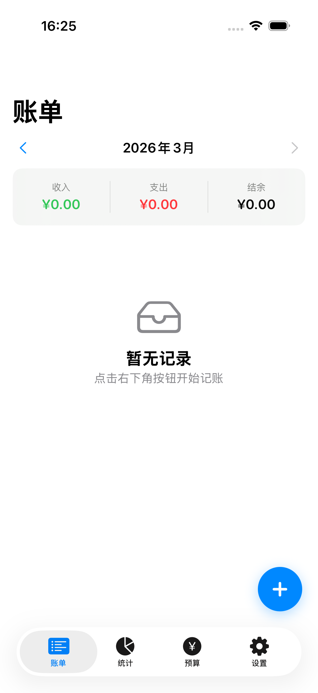
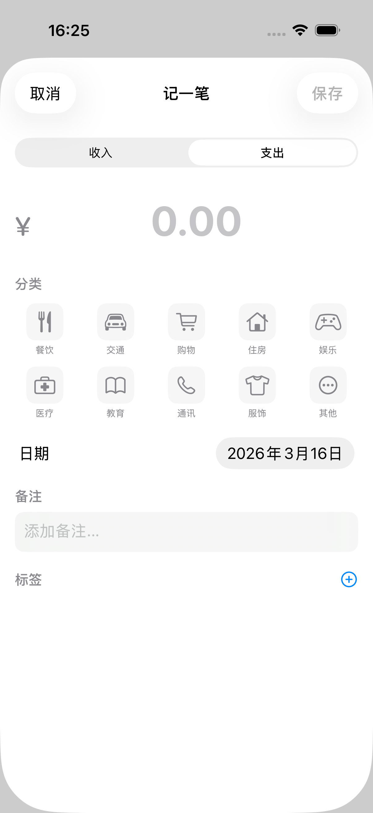
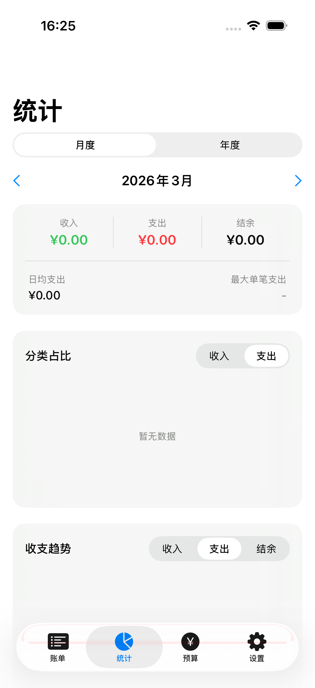
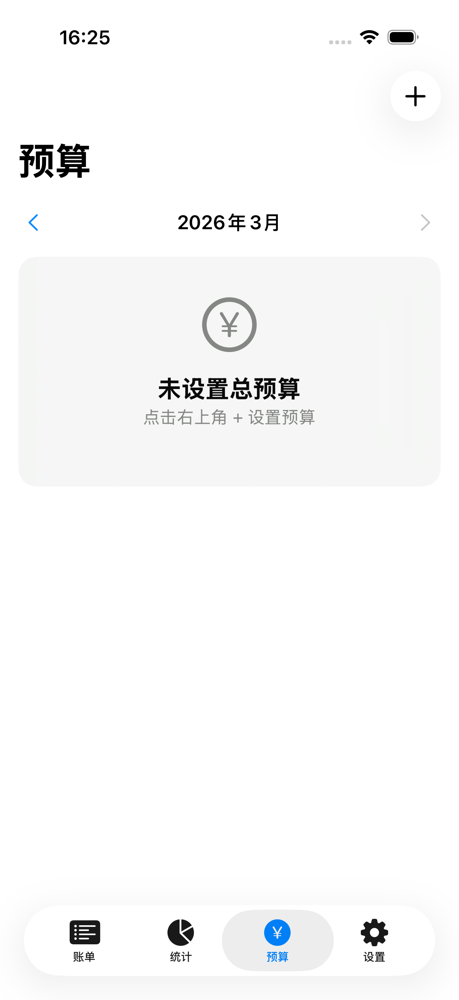
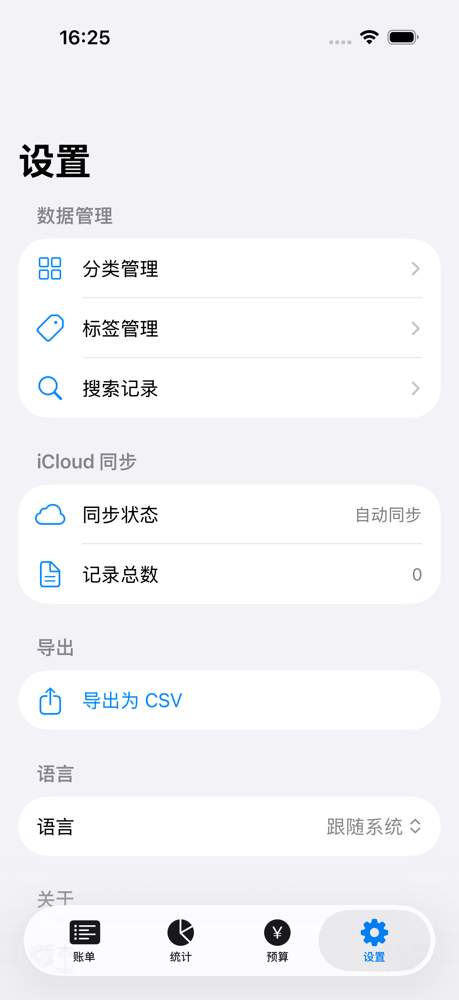
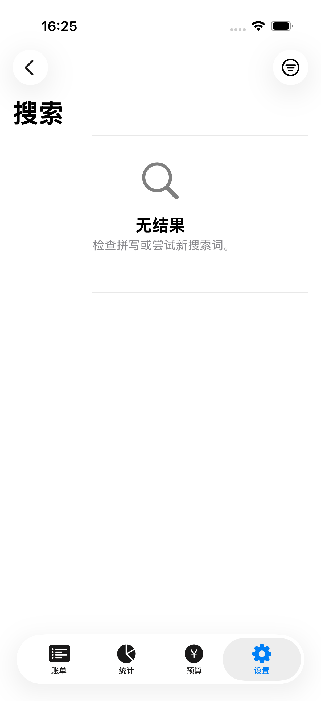
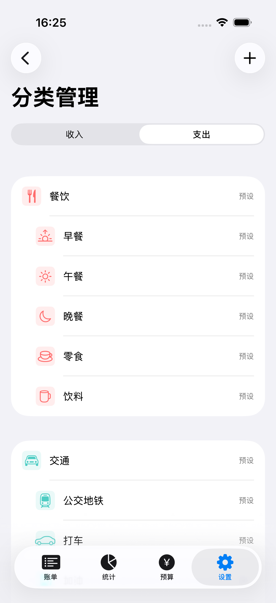
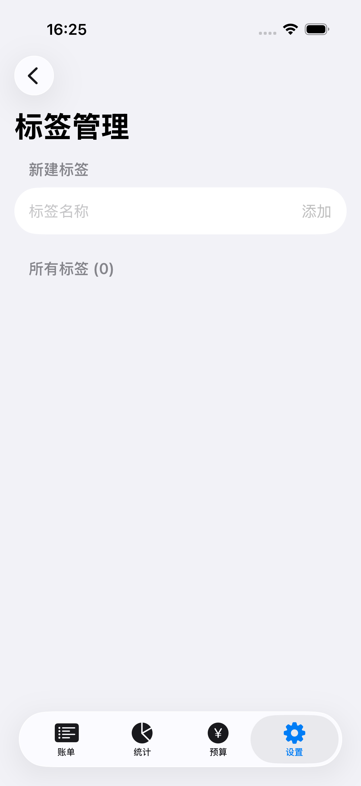

# Keep Accounts 记账

**English** | [中文](README.zh.md)

An iOS personal finance app built with SwiftUI, supporting income/expense tracking, budget management, statistical analysis, and iCloud sync.

## Screenshots

| Home | Add Transaction | Statistics | Budget |
|:---:|:---:|:---:|:---:|
|  |  |  |  |

| Settings | Search | Category Management | Tag Management |
|:---:|:---:|:---:|:---:|
|  |  |  |  |

## Features

### 💰 Transaction Management
- Support for both income and expense transaction types
- Amount input with currency formatting
- Category selection with hierarchical parent/child categories
- Flexible tag-based transaction labeling
- Date picker and note/remarks support
- Transactions grouped by date within a monthly view

### 📊 Statistics & Analytics
- Monthly and yearly multi-dimensional statistics
- Pie chart breakdown by category
- Line chart for income/expense trends
- Summary card: total income, total expenses, balance, daily average, largest single transaction

### 📋 Budget Management
- Set monthly total budget
- Set per-category budget limits
- Circular progress ring visualizing budget usage
- Overspend alert warnings

### 🔍 Search & Filtering
- Full-text search across notes, category names, tags, and amounts
- Filter by transaction type, category, and date range

### 🏷️ Categories & Tags
- 10 preset expense categories (Dining, Transport, Shopping, Housing, etc.) with subcategories
- 5 preset income categories (Salary, Bonus, Investment, Freelance, etc.)
- Custom categories: 20+ icons and 15+ colors available
- Custom tags with multi-tag support per transaction

### ⚙️ Settings & Data
- Export all transactions as CSV
- Automatic iCloud sync
- Multilingual support (Simplified Chinese / English / Follow System)

## Tech Stack

| Technology | Description |
|------------|-------------|
| SwiftUI | Declarative UI framework |
| SwiftData | Data persistence |
| CloudKit | iCloud sync |
| Swift Charts | Chart visualization |

## Project Structure

```
keep-accounts/
├── Models/                  # Data models
│   ├── Transaction.swift    # Transaction record
│   ├── Category.swift       # Category (hierarchical)
│   ├── Budget.swift         # Budget
│   ├── Tag.swift            # Tag
│   └── TransactionType.swift # Transaction type enum
├── Views/                   # View layer
│   ├── MainTabView.swift    # Bottom tab navigation
│   ├── Home/                # Home (transaction list)
│   ├── Statistics/          # Statistics (pie chart, line chart, summary)
│   ├── Budget/              # Budget (overview & settings)
│   ├── Search/              # Search
│   ├── Settings/            # Settings
│   ├── Category/            # Category management
│   ├── Tag/                 # Tag management
│   ├── Transaction/         # Add transaction
│   └── Components/          # Shared components
├── Data/                    # Preset data
│   └── PresetCategories.swift
├── Extensions/              # Extensions
│   ├── Color+Extensions.swift
│   ├── Date+Extensions.swift
│   └── Decimal+Extensions.swift
└── Localizable.xcstrings    # Localization strings
```

## Requirements

- Xcode 16+
- iOS 17+
- Swift 5.9+

## Getting Started

```bash
git clone <repo-url>
cd keep-accounts
open keep-accounts.xcodeproj
```

Select a target device in Xcode and press **Run (⌘R)**.

## License

MIT
